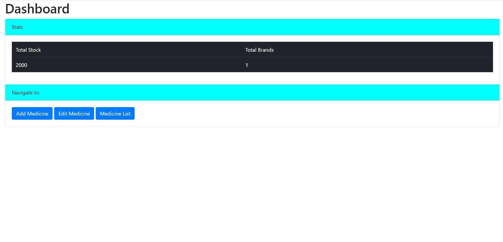

# Med-App

Steps to run this web app:

Step 1: Open command prompt and navigate to web app's present folder.

Step 2: Type command "node server.js" in order to start the server.

Step 3: Open your browser and navigate to this link: "http://127.0.0.1:5002"

Home Page:

Dashboard Page:

Add Medicine Page:

Medicine List:

Edit Medicine Page:

